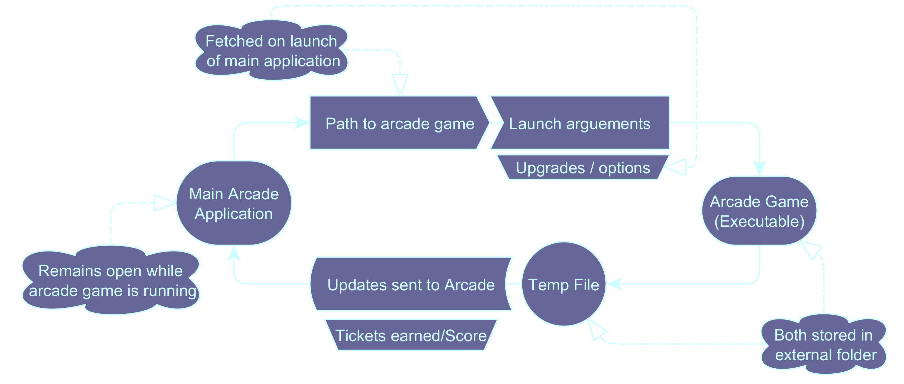
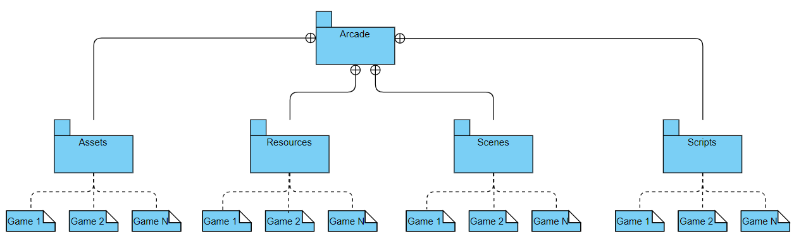
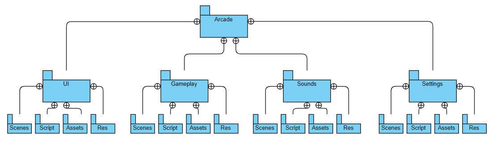
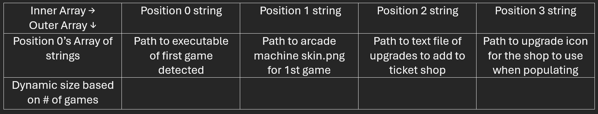

#  CSCI 265 Product Design (Phase 3)

## Team name: MacroHard

## Project/product name: 'Cyber' Cyber City

## Contact person and email

The following person has been designated the main contact person for questions from the reader:

 - Alister Lawson, AlisterLawson64@gmail.com *main contact*
 - Bruce Fernandes, bruce2005.ind@gmail.com *secondary contact*
 - Jamie Mano, jamieysabelmano1018@gmail.com
 - Marek Bettzig, bettzig@hotmail.de
 - Nick Biagioni, viud2l_1061684@d2l.viu.ca

# Table of Contents

1. [ Known issues/omissions ](#section1)

2. [ Product overview ](#section2)

3. [ Core design influences ](#section3)

4. [ Architectural design ](#section4)

5. [ Arcade Scene ](#section5)

6. [ Player Scene ](#section6)

7. [ NPC Scenes ](#section7)

8. [ Arcade Machines ](#section8)

9. [ Ticket Shop ](#section9)

10. [ Built In Games ](#section10)

11. [ File structure ](#section11)

12. [ Initializing the program ](#section12)

13. [ Game state and flow of play ](#section13)

14. [ Transition to physical design ](#section14)

15. [ Glossary ](#section15)

# 1. Known issues/omissions 

In this section, we list any currently known errors, omissions, or other issues with the rest of this design document.

- The feature list has yet to be finalized. Its introduction will mark a significant shift in the project’s workflow, bringing much more clarity to each design element outlined below.
- The game development is still in the proof of concept/prototype phase. As a result, development has been highly decentralized and has not yet adopted the planned Git workflow. This causes problems for the design process, as many features are being implemented before they have been properly documented.
- Several arcade games are already deep into development but have not yet been implemented in the arcade. This is due to the lack of a standardized process for game implementation, which reflects a flaw in the current prioritization of development tasks. This delay also affects the clarification of the token and ticket shop interactions, as both need to be implemented before a concrete statement can be made.
- A standardized method for implementing games has yet to be decided, making it difficult to provide clear guidelines on what a developer needs to get their game running in the arcade.

[//]: # (////////////////////CHAPTER ENDS////////////////////)

# 2. Product overview 
Welcome to the Virtual Arcade, a cutting-edge online gaming platform that brings the thrill of arcade gaming directly to you. With a diverse selection of classic and modern games and immersive environments, the Virtual Arcade offers an unparalleled gaming experience for players of all ages.

- Access a wide range of games, from beloved retro classics like Mortal Kombat and tetris to modern games such as vampire survivors Regular updates with new games and genres ensure there's always something fresh to play.

- Experience beautifully designed virtual arcade settings, complete with realistic soundscapes and engaging visuals that transport you back to the golden age of arcade gaming.

- Navigate the Virtual Arcade easily with an intuitive interface designed for gamers of all skill levels.

- Compete against yourself as you strive to beat your own records and climb to new heights.

- Enjoy addictive single-player experiences with varying levels of difficulty, ensuring that both casual players and hardcore gamers find something to love.

- Regular updates with new games from external developers ensure there's always something fresh to keep you entertained.

- Our Virtual Arcade offers a captivating single-player gaming experience that combines the charm of classic arcade games with modern technology.

[//]: # (////////////////////CHAPTER ENDS////////////////////)

# 3. Core design influences 

When developing a game in Godot, several key design influences shape how you structure, build, and optimize the game. Here are some important factors:

1. Godot's Node System
Godot uses a node-based system where everything in the game—like objects, characters, or UI—are nodes. These nodes are organized in a tree structure, with each node having a specific role (like controlling movement or visuals). Understanding this system is essential for keeping the project organized.
- Scene Instancing: Scenes are collections of nodes that can be reused. This is helpful for managing 3D assets like characters or environments and helps with modular development.

2. GDScript and Visual Scripting
Godot provides two main ways to script the game:
- GDScript: Godot’s built-in scripting language is designed to work closely with the engine. It’s easy to use and makes testing and updating features quick, allowing fast iterations during development.
- Visual Scripting: For those who prefer not to write code, Godot’s visual scripting lets you create logic using nodes and connections. This is useful for designers or those less familiar with coding.

3. Scene Graph and Transformations
Every 3D object in Godot has a transform that controls its position, rotation, and scale. Objects are arranged in a hierarchy, meaning when you move or rotate a parent object, its children follow. This system helps organize complex scenes and animations.
- Spatial Nodes: The main building blocks for 3D objects are spatial nodes. Managing these nodes well is important for the structure and performance of your game.

4. Physics and Collision
Godot has a built-in physics engine that handles how objects interact:
- Collision Detection: The engine supports different kinds of physics bodies (like rigid bodies or static objects), allowing for realistic interactions.
- Collision Layers and Masks: By using collision layers and masks, you can control which objects interact, helping to improve performance and avoid unnecessary calculations.

5. Lighting and Shadows
Lighting is a key part of any 3D game’s design:
- Dynamic and Baked Lighting: Godot allows for both real-time lighting (with shadows) and pre-baked lighting. Pre-baked lighting can save performance, while real-time lighting adds more dynamic effects.

6. Retro Aesthetic and Cardboard-Style NPCs
In our project, we chose a retro aesthetic and cardboard-style NPCs to simplify asset creation and save time.
- Retro Look: We used pixelated graphics because they are faster to create. This retro style also gives the game a nostalgic feel, fitting within the project's scope.
- Cardboard-Style NPCs: To deal with limited resources, we used cardboard-like NPCs. These simple, low-detail characters match the retro theme and let us focus on gameplay without worrying about high-detail models.

These design influences help shape how the game is built, keeping it simple, efficient, and focused on core gameplay elements.

[//]: # (////////////////////CHAPTER ENDS////////////////////)

# 4. Architectural Design 

Our program will be composed of many different scenes* that are responsible for different parts of the system. these components will be separated by scene and all will be contained within the main Arcade scene's tree.

Godot's Scenes are classes that store all functionality within them as children nodes to the scene's root node, nodes can represent any kind of funcitonality from a texture file to a material for the physics engine to a light source.
All nodes can have scripts attached to them.

For ease of development and to reduce coupling, most transfering of variables, references, and other data will propagate downwards within a scene's tree. since all scene trees are stored within the main arcade scene when they are being used any functions of the program that require pulling data from multiple child scenes should should be stored in the script at the root of the main arcade scene. The following will list the positions of all main scenes that constitute the program.

- The Arcade Scene is the main scene that handles and stores all other scenes. it also hase nodes itself that handle the environment, its physics, and its rendering. 
- The Player Scene is located as a child node of the arcade scene and mainly contains nodes with scripts for movement, and interaction with other objecst within the arcade
- NPC Template Scene is only located and loaded from the rescources before compilation for us to create more NPCs quickly
- Arcade Game Template Scene is only located in the resources before compilation and is instanced as needed by the program
- Ticket Shop Scene is located within the main arcade scene.
- Premade NPC Scenes are manually placed within the main arcade scene
- Premade Arcade Machine Scenes are manually placed within the main arcade scene
- Built-in Game Scenes are located within the resources and only loaded when the premade arcade machines are interacted with
- Externally Stored Arcade Games are not loaded or stored within the arcade scene at any point since they are external executables they must be run separately from the arcade application.

[//]: # (////////////////////CHAPTER ENDS////////////////////)

# 5. Arcade Scene (TODO) 

The arcade scene will include all nodes that control it's environment as well as connections to builtin and imported arcade games. include:

- 3D Environment and Lighting@
- The Gridmap@ (just What a gridmap does, functionality in other chapters)
- Audio@
- Built-in NPCs (functionality in other chapters)
- Built-in Arcade Machines (functionality in other chapters)
- Instanced Arcade Machines (functionality in other chapters)
- Ticket Shop (functionality in other chapters)
- Exit Door@

(write how all nodes with @ next to them work)

[//]: # (////////////////////CHAPTER ENDS////////////////////)

# 6. Player Scene 
The Player scene is composed of 3 parts:

- The movement module
  - user inputs -> character velocity
  - user input -> camera rotation
  - collision
- raycast module
  - calling the object that the raycast collides with's interact() function
- The player data
  - Ticket count storage
  - Token count storage

### 6.1 Movement
Directional Movement will be achieved by taking user input and converting it into a vector to be used as velocity withing godot's builtin physics engine. The vector will be generated as by taking the directions the player is pressing as inputs and converting as a directional sum in the form of a vector. so say they press left and up it would convert that to a vector: [x: (-1* speed, z): (1 * speed), y: 0]

Camera movement will be achieved by converting player inputs into a 3d rotational vector to rotate a camera node. it will work by either mouse movement or joystick input. More research is needed on how to impliment this since there have been problems identified as [Gimbal Lock](https://en.wikipedia.org/wiki/Gimbal_lock). This will be updated later when a solution is found.

Collision will mostly be handled by Godot's physics engine however we will have to ensure that all player movement is done by setting the player scene's velocity rather than position since setting position bypasses the physics engine.

### 6.2 Raycast
The raycast will be a rotational child to the player's camera node so that it always collides with whatever is on the center of the screen. Players will be able to interact with objects by calling a godot's builtin function that takes whatever object the raycast collides with and calling it's defined interact function. It will need rejection of objects without an interact function defined.

### 6.3 Player Data

Player data will be stored as as variables within a script attached to the root node of the player scene so they are easily called and referenced by the parent and sibling scenes.

Ticket count will be stored as an interger and token count will be stored as an interger.

[//]: # (////////////////////CHAPTER ENDS////////////////////)

# 7. NPC Scenes 

There will be a two NPC scene types designed for the software:

- Template NPC scene with basic functionailty
- Premade NPCs with specially designated written behaviour within their functions

### Template NPCs

template npcs serve as a  developer rescource for us to quickly duplicate then customize to create custom NPCs. They may also be used to instance custom NPCs defined by end users but there are no plans to impliment that in the first version. the template NPCs will have:
- a placeholder sprite
- a placeholder interact function
- a placeholder player performance reaction function

These Template NPC's will be implemented for a plethora of use cases. They will be used to help poor and struggling players with handouts. They can act as marketing for developers as well and more.

### Custom NPCs:

### BruceNPC:
- When Interacted with, he will change from a standing sprite to a speaking sprite where he will introduce himself as the shopkeeper.
- He will react with a shop menu with the different powerups, add-ons and other purchasable items for tickets.
- For more information go to Ticket Shop, Chapter 9.

### NateNPC:
- When Interacted with, he will change from a standing sprite to a speaking sprite where he will chat with you about games in the arcade. He will simply ask questions and record the answers later to be used as feedback for improvements of the arcade.
- If the player picks specific dialogue, Bruce will react by giving a special record to add to the jukebox

### AlisterNPC:
- When interacted with, he will bring about a tutorial of sorts for the player to get to grips with how to play games in the arcade and help with information on the arcade.

[//]: # (////////////////////CHAPTER ENDS////////////////////)

# 8. Arcade Machines 

There will be two kinds of arcade machines. while nearly functionally identical to the user, under the hood they behave differently:

- Premade, Pre-placed Arcade Machines
- Instanced Arcade Machines

### 8.1 Premade Arcade Machines
Premade Arcade Machines Will have built-in games (See chapter 10) and built-in textures and models

Premade Arcade Machines will be defined during development and use a completely different interact function that loads a new godot scene that contains the built-in game, since it is loading a new scene, the main arcade simulation ends, so we will store the player's data within the temp file. When the game is complete and the player is send back to the arcade the arcade will load the player's data from the temp file. The player data stored will include; position, ticket count, token count, and purchased upgrades.

### 8.2 Instanced Arcade Machines
Instanced arcade machines will use imported games and assets (see chapter 12). 

Because the games that are played on the instanced arcade machines are stored externally as an executable, they will be run as a separate program. in order to communicate between the two programs we have developed a two way communication loop.

The arcade only needs to send data when the arcade game is launched and only needs to recieve data when the arcade game is closed. 

In order to send data as it launches it will send it within the launch arguements. 

The main arcade will assume the external arcade game is running and pause itself. While paused it will only run a looping function that scans a temp file for updates. This temp file is how the arcade game sends data back to the main arcade application.

When it detects a change in the temp file it will copy the data and then clear the file and resume the main arcade simulation. The player score given will be converted and added to the player's ticket count. 

[//]: # (////////////////////CHAPTER ENDS////////////////////)

# 9. Ticket Shop 

- Ticket Shop will be implemented with BruceNPC, he will open a shop menu when interacted with.
- The Ticket amount will go down upon making a purchase and Prices will be set by MacroHard
- Purchasable items include buffs/power ups for games, new games, new background music.
- The UI will be done with a 2D tilemap and arrays in order to create interactable buttons to hit to purchase items.
- Before making a purchase, a confirmation message box will pop up so you can confirm your purchase.

[//]: # (////////////////////CHAPTER ENDS////////////////////)

# 10. Built In Games 

The Arcade will feature built-in games developed by us in our personal time. here we are providing a brief description of the games and their token cost/ticket reward but it is not our plan to document them in detail since they are all solo projects

### Jetris / The Pinaytrix
Jetris is a clone of the classic Tetris, featuring falling tetromino blocks that players rotate and move to create complete horizontal lines. When a line is cleared, it disappears, and the blocks above shift down. As the game progresses, the speed increases, challenging players to keep up. The game ends when the blocks stack up to the top. Jetris includes classic features like score-based line clears and a next-piece preview. More features will be added once the implementation of the game is done like background music and cool animations.

### 2Cool4Pool
2Cool4Pool is a bird's eye view recreation of pool. With an easy to understand set of rules but deceptively complex physics, there is a low skill floor but a high skill ceiling. The token cost to play pool will be 1 and the amount of tickets earned will be based on how many turns it took you to sink all the balls.

### Scrap 
Scrap is a 2-D fighting game with two players. One player on the left and the other on the right. They must fight to the death. characters can string combos with multiple attacks and players will have the option of a combo breaker once per round. different characters will have different attacks and combos allowing for modular content where matchups can be different.

### Blutsauger Superschlager 
Blutsauger Superschlager is a minimalist, rogue-lite survival action game, heavily inspired by Vampire Survivors. Players face waves of monsters in a pixel-art world, controlling a character who automatically attacks while focusing on dodging enemies and collecting power-ups. Defeated enemies drop gems that grant experience points, which can be used to unlock new abilities, weapons, and upgrades. The gameplay emphasizes strategic movement and quick decision-making as enemy hordes grow in size and strength over time. Though it's a clone of Vampire Survivors, its fast-paced combat and addictive progression system offer a familiar yet thrilling challenge.

[//]: # (////////////////////CHAPTER ENDS////////////////////)

# 11. File structure 

As we build each our game on our own, we are implementing a sorted by file type structure (see the diagram below). This will be easier for us to access assets, resources, scenes, and scripts as we implement our game. All the images used will be in the Assests, other files used will be in the Resources, scenes used will be in the Scenes, and scripts will in Scripts. As this would be easier for a protoype, this will be difficult to implement when games come all together where changes made for one game inadvertently affect other games, introducing bugs or inconsistencies.

Hence, with the final file structure, we are implementing a sorted by feature file type structure. Instead of having all scripts, scenes, assets, and resources in their own folders for each game, we would be having all of those in their own folders for all games in the arcade. With files related to UI, all of those will be in UI folder with their own Assets, Resources, Scripts, and Scenes inside. This would be followed for every files inside the arcade (see the diagram below).

With this implementation, it will be easier for us to expand and modify individual features without affecting unrelated parts. In addition, with expanding range of games, this will be a problem for what we are implementing in our prototype structure where files are sorted by type, can become overwhelming as you add more scripts, assets, or scenes, making it harder to keep track of which files belong to which feature. Overall, with sorted by file feature, it will be easier to debug, simplified testing and optimization, better scalability, easier version control, and better extrenal integration with developers uploading their games.

[//]: # (////////////////////CHAPTER ENDS////////////////////)

# 12. Initializing the program 

When the program launches there will be a setup process before the user may interact with the software.

The steps to initializing the software will mostly serve to accomodate any games added to the arcade. All steps for the initialization will be:

- Importing Arcade Games
  - Scanning the external "arcade_games" folder for any games to add to the arcade
  - generating unique instances of the arcade machine template scene for each game found in the folder
  - Generating A file path to each game and placing it in it's respective instanced arcade machine scene's interact() function
- Generating Arcade Layout
  - Creating a 2D array of map layout with room for all arcade games detected
  - Detecting borders and connections to correctly place wall meshes
  - converting array positions and values to instanced meshes on Godot's gridmap

## 12.1 Importing Arcade Games

When the program first launches the initialization function will be called to start the process. the first operation will be to scan the external folder for Any valid games provided by developers (see requirements document for needed rescources for adding a game) should all necessary files be there, a 2D array of strings that each store paths to all assets for each game will be generated. We will refer to this as the Game Files Array. 

The next step in the initialization process is to generate the arcade machines using the Game Files Array. Each Arcade Machine will be an instance of a pre-defined Arcade Machine template scene. The program will go through each outer position of the Game Files Array and create an instance of the arcade machine template scene with the current position's array of strings as a parameter until the entire array has been traversed.

The template scene will have a script that runs when it is instanced. 
- The instanced script will assign the path to the game's executable as the behaviour for the arcade machine's interact function. 
- The path to the arcade machine's skin.png will be imported then placed on the base arcade machine's mesh
- The Upgrades text file (Which has not been decided if we will use xml, Json, ect..) will be read to add clauses to the interact function should relevant upgrades be detected. The upgrade information will be sent to the arcade via launch arguements. See Chapter 8
- Upgrades icon.png path is not used by the arcade machine instance but will be used by the ticket shop.

Because all instances are being created within the main Arcade scene they will all currently have an overlapping position. They will be moved later in the generating layout step.

## 12.2 Generating Layout

[Godot Gridmaps](https://docs.godotengine.org/en/stable/classes/class_gridmap.html#class-gridmap) will handle the arcade environment's collision, meshes, and mesh instancing. We only have to provide it with a base set of meshes in the form of a [Mesh Library](https://docs.godotengine.org/en/stable/classes/class_meshlibrary.html#class-meshlibrary). We must define what cells within the gridmap we want occupied, what mesh is within those cells, and optionally the rotation, and transform of those meshes. Usually this is done within the editor by "painting" levels with our pallete of meshes, however; this must be done manually and doesn't work at runtime, so the following solution is required.

The parameter for generating the layout will be the same Game Files Array used in the previous step. 

This function will take the number of positions within the array and create a matrix of 2 character arrays to represent the layout. In order for the player to be able to navigate between the arcade machines, there are several adjacency rules that must be conformed to.

The first step will be determining the placement of all arcade machines. The first loop of the array with, for instance, two arcade machines will look something like this should it be printed out:

    [U,U] = undefined spaces
    [0,2] = arcade machine instance 0 with enum direction 0-3 (north,south,east,west)

    [U,U][U,U][U,U][U,U][U,U]
    [U,U][0,2][U,U][1,3][U,U]
    [U,U][U,U][U,U][U,U][U,U]

Adjacency rules are enforced by comparing all array positions immediately adjacent to an arcade machine postion and all postions within the previous and next array. All adjacent cells should contain undefined spaces and arcade machines should never be at an end of an array without an empty space between. If a position passes the checks it will assign it as an arcade machine position until all arcade machines have a position.

The second pass will determine what mesh from the mesh library should be used in the cells. The rules are to only assign wall mesh pieces at the edges of the array and all along the final array as well

    [-,+] = Wall mesh with Southern Wall(back along x axis) and eastern wall(forward to the z axis)
    [+,E] = Wall mesh with wall on the positive x side and no other walls.
    [E,E] = no walls only floor tiles

    [-,E][E,E][E,E][E,E][+,E]
    [-,E][0,2][E,E][1,3][+,U]
    [-,-][E,-][E,-][E,-][+,-]

The third pass will be reading each cell's data and converting it to a cell position and mesh ID to place on the gridmap. When it finds a cell with arcade machine data, which would be anything that has a number instead of a character, it will place a floor tile mesh with no walls, then move the respective arcade machine with matching instance number to that position. 

The layout generation should be complete after this step and, should we end up using Godot's baked lighting now would be the time to do it.

[//]: # (////////////////////CHAPTER ENDS////////////////////)

# 13. Game state and flow of play 

The player starts the game with a certain amount of tickets, which are used to play the arcade machines. To do so, the player walks up to an arcade machine and interacts with it, entering the game scene. A ticket is then consumed as payment to play. After completing a game, the player is rewarded with tokens. The number of tokens received is based on the player's performance (i.e., their high score).

Tokens can be used at the ticket shop in the arcade, where they can be traded for more tickets to continue playing, or for upgrades to the arcade games. These upgrades make the games faster or easier, helping the player win more tokens more quickly. This forms the core gameplay loop of Cyber Cyber City.

Additionally, tickets can be found around the arcade or obtained by interacting with NPCs, preventing the game from soft-locking if the player runs out of tickets and cannot buy more.

In short, the typical game flow looks like this:

- 1. Game starts
- 2. Player plays an arcade game
- 3. Player receives tokens
- 4. Player buys more tickets at the ticket shop
- 5. Player plays more games
- 6. Player earns more tokens
- 7. Player buys upgrades for games
- 8. Player unlocks new games
- 9. Repeat from step 2

The game can be exited by walking to the exit of the arcade. Inside the arcade, there is also a jukebox that plays music, opens the settings menu, and allows players to save and load their game.

[//]: # (////////////////////CHAPTER ENDS////////////////////)

# 14. Transition to physical design 

The arcade is currently still in a prototype stage. To transition it into the finished game, the listed design choices will be converted into a feature list. Each feature on the list will encapsulate a specific function of the game, clearly defined in its description. By listing features in this way, it won’t matter which team member works on them, as long as they adhere to the defined description. This workflow will shift the project to a feature-based implementation, aligning more closely with the agile work model we aspire to. The feature list will be managed in GitHub’s project manager, which is already being used for planning the documentation. After that, the feature descriptions can also be used to create standardized tests for all new functions and releases. Another key focus for the next phase of the project is developing a framework for integrating games into the arcade. Once the first game is implemented, the process will be documented and standardized.

[//]: # (////////////////////CHAPTER ENDS////////////////////)

# 15. Glossary 

The terms "User" and "player" are referring to the end user of the product, an audience who are using the final software combined with games, for the purposes of recreation or historical research.

The terms "developers" and "game developers" refer to the audience who will use the arcade software to host their games for the end user.

 - Scenes refer to godot's defintion of classes 

 - nodes refer to elements within godot's scene usually these elements define behaviours of the scene.

 - Vectors are a built in data type in GdScript they can store any data type in a 2, 3 ,or 4 element vector.

### Acronyms
 - NPCs | non-player characters.
 - 3D and 2D | three dimensional and two dimensional respectively. Usually referring to an object's appearance.
 - GUI | graphical user interface, generally a 2D overlay that displays information.
