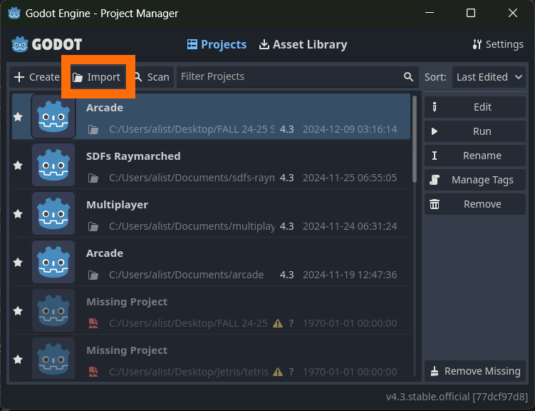
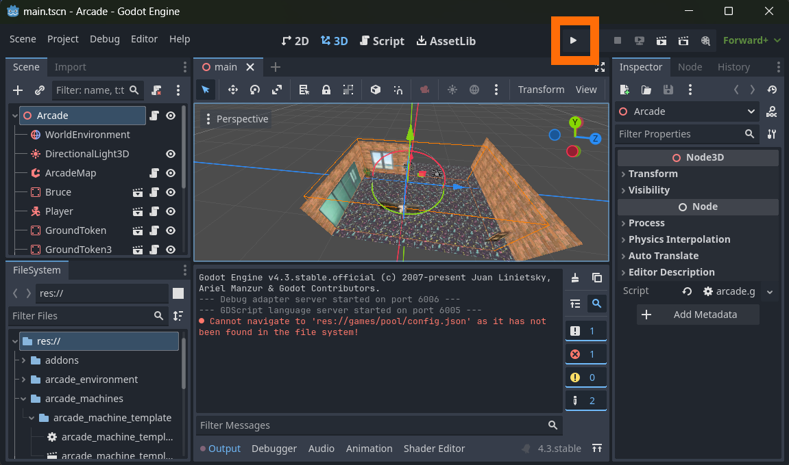
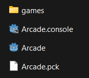

# Launch Instructions
Ver. 1

## Team name: MacroHard

## Project/product name: 'Cyber' Cyber City

### Contact person and email:

Alister : AlisterLawson64@gmail.com

##

*This document provides instructions on how to run and compile 'Cyber' Cyber City on a Windows based operating system.*

## Setup:

Download and install [Godot Editor Version 4.3](https://godotengine.org/download/archive/4.3-stable/) into a public access directory (one that does not require administrator permission).

Download the "CyberCyberCity" folder located inside the github repository and place it into a public access directory.

Launch the Godot engine.

Select Import:

Within the popup, navigate to the location you have placed the CyberCyberCity folder. Open CyberCyberCity and select the "project.godot" file then click "open". In the new popup window select "import and edit" this will launch the editor and open the software.

Importing process complete.

[Godot Project Manager Documenation](https://docs.godotengine.org/en/stable/tutorials/editor/project_manager.html)

## Running the software inside the Godot editor:

Within the editor the play button can be pressed to launch the software.

This will launch an empty arcade with no arcade machines and an open wall where the arcade machine hallway can be generated.

In order to import games into the arcade that is run from the editor the "games" folder from the github repository must be placed inside the CyberCyberCity folder.

Once it is placed inside the arcade should generate two arcade machines and a short hallway next time the program is launched through the editor.

Any additional games are to be placed within this folder as well while running tests or developing within the editor.

## Compiling and running the compiled software:

If you have placed the "games" folder inside the CyberCyberCity folder: Before exporting the project store the "games" folder somewhere outside of the CyberCyberCity folder.

Follow Godot's [exporting projects documentation](https://docs.godotengine.org/en/stable/tutorials/export/exporting_projects.html) and use the windows template. Linux template is untested and may run into issues. 

The executable and accompanying files MUST be placed inside a directory that does not require administrator privliedges to read or write to

place the the github repository's "games" folder in the same location as the arcade's executable.

The arcade's directory should look like this:

Launch the arcade.

