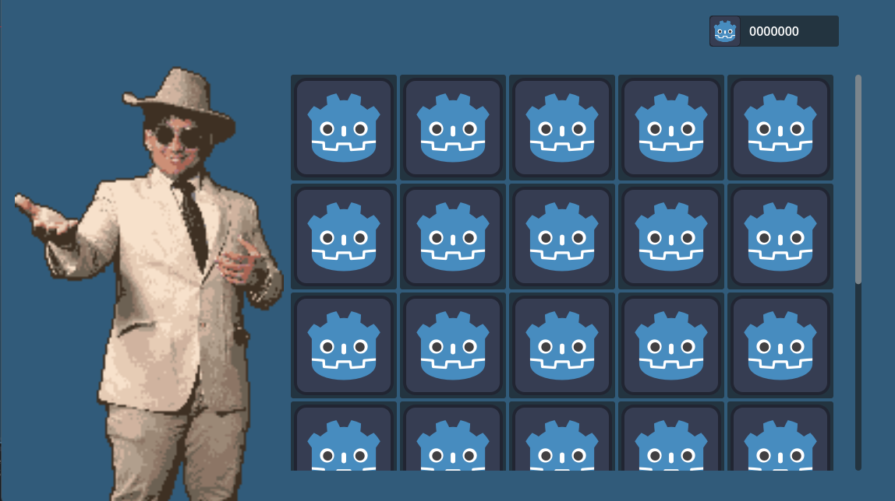

# CSCI 265 Proof of concept
## Team name: MacroHard
## Project/product name: 'Cyber' Cyber City
## Contact person and email

The following person has been designated the main contact person for questions from the reader:

   - Alister Lawson, AlisterLawson64@gmail.com main contact
   - Bruce Fernandes, bruce2005.ind@gmail.com secondary contact
   - Jamie Mano, jamieysabelmano1018@gmail.com
   - Marek Bettzig, bettzig@hotmail.de
   - Nick Biagioni, viud2l_1061684@d2l.viu.ca

# 1. Technical challenges

In this section, we outline four key technical hurdles that are important for the successful implementation of the project:

- 3D environment
- Video streaming, audio, and lighting
- Ticket shop UI
- Communication loop and program integration
- Arcade layout generation

Each of these aspects is essential for realizing the game's vision or plays a core role in the gameplay loop.

## 1.1 3D Environment

The 3D environment was the first hurdle in the game's implementation. Our main concern was whether it would be possible to program a 3D game within the semester's timeframe. The focus of this issue was creating a 3D environment that allowed players to move around within it.

## 1.2 Video streaming Audio/Lighting (Nick TODO)
Text...

## 1.3 Ticket Shop UI
Since the team wanted to bring out a real arcade experience by implementing spatial sounds and interactable NPCs, the User Interface for the Ticket Shop would mainly focus on bringing that experience.

Imagine you have a unrightful amount of ticket, and you wanted to see what you could buy from the shop from your tickets. You walked to the shop excited with the items you see. All those hardwork will paid off with a chocolate bar or a stuffie. The shop person assists you and ask if you wanted to purchase more ticket or exchange prizes. Those interaction with the shop keep, excitement, checking to see if you have the right amount of ticket, feeling the eagerness to buy something worthy but its too expensive, wanting to get back and play more, and happiness when you got what you wanted are the main objectives for the implementation. We would work on that case scenario, and build/define an interface. 

### Technical challenge
- This will become an issue when more items are put inside the shop. For the final shop, we would implement more of grid box, that expands on its own depends on the number of items. 

## 1.4 Communication loop and importing programs (Alister TODO)
Text...

## 1.5 Arcade Layout Generation
Arcade Layout will be generated based on the number of arcade games. It will be generated in the  grid format of Godot.
The layout will be generated with the algorithm W = M * 2 + 2, Where W is the width of the grid map and M is the number of Arcade Machines. The height will be set by us the Developers as an arbitrary constant.

# 2. Approach to meet each challenge

## 2.1 3D Environment

At the outset, we developed a backup plan in case we were unable to create the 3D environment. This plan involved downsizing the project to a 2D environment with a top-down view of the player character. To tackle the challenge more effectively, we divided the requirements into four parts:

- Creating a 3D world using the Godot game engine 
- Developing a movable character in the 3D world (in this case, the camera as the player)
- Designing NPCs that can be placed within the 3D world
- Transitioning from the 3D world into gameplay using the player character and objects in the environment

## 2.2 Video streaming Audio/Lighting (Nick TODO)
Text...

## 2.3 Ticket Shop UI
To have a generative prizes to go on the shop rather than a manually putting it, we would touch on the basic of how the Tetris game was formed.

- Would touch more on the implementation of the Tetris game, where blocks are populated inside the 2D game grid.
- Define the shop grid with 5 columns (prizes icon in the same sizes) and a row integer that doubles when row capacity is reached.
- Defining shop cells as grid slots with piece position,  create an add item node to the grid and set up the position logic.

## 2.4 Communication loop and importing programs (Alister TODO)
Text...

## 2.5 Arcade Layout Generation
The Grid will be first in array form and converted into the grid map. The array will be encoded with cells in the form (+/-,+/-) + meaning North or East depending on which coordinate it is in. - meaning South or West Respectively. Each direction means the walls would be in that direction. If neither + nor - is used the tile will have no walls and instead just have a floor. Arcade machine tiles will have only the floor tile and arcade machine on them.

# 3. Assets produced

## 3.1 3D Environment

To create the 3D world for the arcade, we utilized Godot's grid system. This involved assembling a collection of tiles that we could use to construct the arcade, including floor and wall tiles with all possible rotations. Each tile's mesh is combined with a texture and a hitbox, allowing the player to walk on them and preventing them from passing through walls.

Once the arcade was complete, we implemented the player character for player control. To enhance immersion, we chose a first-person view by not using a 3D mesh for the player character and instead employing the in-game camera to represent the character. We then set up a control scheme that allowed the player to move the camera around and navigate the 3D world. The controls included adjusting the camera's position and rotation. Additionally, we fitted the character with a collision box to ensure it could interact properly with the environment.

Next, we aimed to include interactive elements in the world. We created an NPC blueprint that could be used for various character types. This included an NPC sprite to be displayed within the world, along with a collision box. Due to time constraints, we opted not to use 3D meshes for the NPCs, giving them a more cardboard cutout appearance. To prevent the NPCs from disappearing when the player walked behind them, we programmed them to always face the player.

Finally, we needed to test that the player could actually enter an arcade game through the 3D environment. For this, we utilized a pool game that had already been developed by one of the group members. We created a mesh and textures for the pool table to place it within the 3D world, ensuring it had a collision box so that other elements could interact with it. Additionally, we implemented a script that switches the current game scene to the pool game scene when the player interacts with the pool table.

## 3.2 Video streaming Audio/Lighting (Nick TODO)
Text...

## 3.3 Ticket Shop UI 
Since Godot supports User Interface, for the prototype we just implemented a scroll container, horizontal box, and a vertical box. Use hierarchy to make the shop grid and populate it with Godot icons, which will be later on replaced by the image itself. The shop keep was grabbed from an existing asset already available on our NPCs directory.

Moving forward, we plan to develop additional assets specifically for the shop, including tickets for purchases, basic prize items, and a themed background that aligns with the shop's visual style. Our goal is to maintain a simple yet fully functional design that effectively demonstrates the shop’s concept and usability.

## 3.4 Communication loop and importing programs (Alister TODO)
Text...

## 3.5 Arcade Layout Generation 
The Different tiles for the grid are opensource assets found online. the walls, floor and roof textures have been taken as such. The Arcade box Textures are made by our own developers and the external games made by other developers will require those developers to give textures for the arcade box.

# 4. Results and implications

## 4.1 3D Environment

The proof of concept was a success, bringing the foundational features to life. This was the first major prototype we built to begin developing the actual game. As a result, the proof of concept served as the foundation for the rest of the game and was incorporated into the repository. Most major features planned for implementation are simply extensions of these core functionalities. The backup plan of creating a 2D arcade was discarded due to the successful realization of the 3D environment. Furthermore, additional smaller features, such as jumping and interacting with NPCs, were successfully implemented on top of the groundwork established by this proof of concept.

## 4.2 Video streaming Audio/Lighting (Nick TODO)
Text...

## 4.3 Ticket Shop UI 
As a proof of result, the image below shows a working protype composed of only containers. It doesn't have any functionality yet. 

## 4.4 Communication loop and importing programs (Alister TODO)
Text...

## 4.5 Arcade Layout Generation 
We have made progress on the coding end and have made python based pseudocode for the array system in the layout generation. The final steps to incorporate the code in gdscript is the final step.
