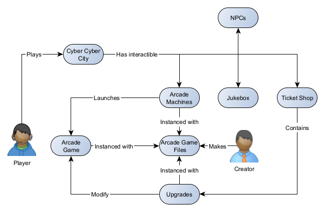
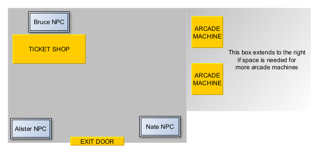
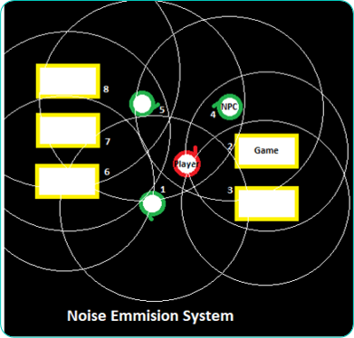

# CSCI 265 Requirements and specifications (Phase 2)
Version 1.5
## Team name: MacroHard

## Project/product name: 'Cyber' Cyber City

## Contact person and email

The following person has been designated the main contact person for questions from the reader:

 - Alister Lawson, AlisterLawson64@gmail.com
 - 
# Table of Contents

1. [ Known issues/omissions ](#section1)

2. [ Game overview ](#section2)

3. [ Target audience and motivation ](#section3)

4. [ Product Perspective ](#section4)

5. [ Key features, with detailed requirements for each ](#section5)

6. [ Example Game Requirements ](#section6)

7. [ Non-functional requirements ](#section7)

8. [ Feature prioritization ](#section8)

9. [ Glossary ](#section9)

## 1. Known issues/ Ommisions 

Measurements used for environment and player use the real world metric system but must be changed to the scale of the geometry of the program within design.

Jukebox location is difficult to decide on with a spatial audio system since, in theory, a user could add enough games that you can't hear the music from the end of the hallway. We will return to this decision once we have a wokring prototype since it will be easy to relocate it and adjust volume and range variables of the music to get a feel for what sounds best and perhaps tie the range to the amount of games imported.

Currently the config file's only use is to define upgrades for a game but it could be important for collecting other unforseen necessary data about the executable, testing more executable types in phase 5 should help us determine if it is necessary.

## 2. Product Overview  
**Cyber Cyber City** seeks to bring you back the the 80s/90s with a historically inaccurate, first person simulation of an arcade. While the early 80s hosted the golden age of [Video Game Arcades](https://en.wikipedia.org/wiki/Amusement_arcade), the decline into the late 90s lead to the rise of the [Redemption Game](https://en.wikipedia.org/wiki/Redemption_game#:~:text=Redemption%20games%20are%20typically%20arcade,a%20central%20location%20for%20prizes.), where players could be awarded tickets proportional to their score and then redeem said tickets for prizes.

Central within the **Cyber Cyber City** arcade is the prize booth/ticket shop, where players will be able to spend their hard earned tickets for prizes, unlocks, and collectables. The over-arching objective for our players may be to try unlocking/collecting everything within the prize booth/ticket shop, however, motivating the player to just have fun and diversely explore all the games available will be our objective as developers.

### Scope

The program's base functionality is a library of executables, presented as an arcade, for creators to populate with arcade-style games, for a player to browse and play.

It is a single player offline application. No internet connection is required.

The program is compatible with Windows operating systems that are version 10 or newer.

## 3. Target audience and motivation 

The arcade will attempt to replicate the feeling of 90s arcades without explicitly copying the floor plan and decor of a specific location. Instead we will be drawing inspiration from many images, memories, and references to create a general "vibe" of a 90s arcade that could have existed. This way we can appeal to individuals nostalgia for old arcades without them scrutinizing the accuracy of a specific location.

Since we have limited time and resources to complete the project, the program won't be a hyper-realistic representation of an arcade. Instead, we plan on going for low-resolution textures and low polygon-count models. This lends itself to an aesthetic that should still appeal to our nostalgic audience while also making it more accessible to those with lower-end hardware.

The arcade itself is our product so we are dealing with two target audiences; the users who want to go to an arcade to play games, and the arcade game developers who will be placing their games within the hub world we create. Since we are also developing games in our spare time we are hoping to ship the arcade with a base catalogue of games to play; however, only one is needed for testing, development, and initial launch.

The individuals in our group are all interested in game development and with the recent drama surrounding what was considered by many to be the most accessible game engine, Unity, we decided to take a risk investing time into learning a much more experimental software to develop on, the Godot game engine. There are many drawbacks to using software that hasn't matured or been around long enough to have a lot of 3rd party support, but, there is a lot of freedom that comes with the open source nature of the software. 

Developing a large amount of games to populate the arcade with is not the goal but rather to provide a platform for users to curate and generate games in a single place. In order to make this platform accessible though we must provide basic examples to build off of. Making at least one example game is within the scope of the project and more games are encouraged so long as it does not cut into the development of the main software.

## 4. Product Perspective 

When a player launches the program they will be placed into the arcade environment. There will be one map that looks like the interior of an arcade. It will have one floor and only one main room that expands to accomodate all imported arcade game's machines. The room may look different depending on the amount of arcade games in a user's collection, but the arcade always contains a shop, an exit door and, so long as the template game is not removed, at least one game. The player navigates from a first person perspective and may walk up and interact with a game they wish to play. The player may interact with the exit door which will close the program.

The user can walk up to and interact with an arcade machine to start up the machine's respective game. Playing arcade games will have a token cost. When you interact with the machine it will automatically subtract the cost from the player's balance.

To encourage sharing of arcade games between users, games will be bundled so they can be easily copied and pasted. into other player's libraries. We will create a game (tetris) as an example resource for creators to use to setup the correct files for their game.

The final product will be compiled in a portable format (all assets within a single folder that can be moved) so that someone can carry their arcade of games with them and slowly build up their collection. 

Individual arcade game experiences are great but what made arcade-goers want to keep playing and come back every time was how all the games were tied together by a universal form of progression: tickets. Ticket count will be tracked. Tickets will be awarded to the player once they have completed an arcade game and returned to the arcade. While the arcade games are the main draw for a player there are other aspects for them to engage with as well such as:

- Navigating to the jukebox object and interact with it to play or pause ambient music.
- Talking to NPCS placed within the arcade with various functionalities
- Using the shop and spend their tickets on upgrades to the arcade machine games.

A high level model of core components and their relationships is provided below.

## 5. Key features, with detailed requirements for each 

### Player character, movement, and controls

Since we are selling our product as an immersive experience the player character is designed to feel like the player is in the acrade when they pilot it. Users are placed directly into the 3D environment upon launching the program so an initial pop-up will show the controls to navigate the map.
The player character has the following characteristics:

- The point of view will be first person. The FOV (Field of view) will be 90 degrees
- There won't be any vertical movement so jumping and gravity aren't necessary.
- The player speed will be about 1.4 meters per second (rounded, average walking speed of a person)
- The player is a circle shape with a 0.5 meter diameter, height isn't necessary since there's no vertical movement
- The camera is positioned 1.6 meters from the ground
- The camera will be moved in the direction the mouse is dragged 
- The camera can rotate infinitely left and right but locks rotation looking down and up 90 degrees from the horizon
- Controls to move the character will be W,A,S,D to go forward, back, and strafe left, and right
- Pressing left click interacts with and object that:
    - has defined behaviour when interacted with
    - is within 2 meters of the player
    - intersects with the center point of the screen

### Ticket and Token Economy

**Tickets** are the rescource used to purchase upgrades from the shop, they are a reward for scoring in an arcade game. The only way a player can have tickets is after they have played a game. Tickets are kept track of as a global "ticket_count" variable with the following properties:

- It can never be a negative value.
- It can never exceed the maximum value of 100,000
- It gets reduced by a shop item's cost when:
  - an upgrade has been selected to purchase from the shop
  - the ticket_count is at least equal to the cost of the item
- It is increased by a game's given score when a game is completed
- Nate will give you 10,000 tickets and take 10 tokens if you interact with him while you have 10 or more tokens

**Tokens** are the resource used as a toll to access the arcade games. Tokens adds stakes to losing a game that is expensive to play but can also become restrictive if a player runs out. Tokens will be stored as a global "token_count" variable with the following properties:

- It can never be a negative value
- It can never exceed 100
- It is reduced by an arcade machine's cost to play when:
  - the arcade machine is interacted with
  - token_count is at least the cost to play
- Tokens can be purchased from the shop for 1000 tickets each
- NPCs will give you a token when you interact with them and your token count is 0. this means a player is never locked out of playing games if they run out of tokens.
- There is a 100*e^-(final_score/2000)%​​ chance to get a token when completing a game. This means your chance decays from 100% at 0 score to effectively 0% chance at 10,000 score.

### Arcade Environment

The arcade itself is a 3-dimensional room populated with various objects. The player must be able to navigate the map without obstruction in order to access the rest of the programs features. The characteristics and details of the arcade map are outlined below:

This image represents an arcade that a user has added one game to since the game already ships with one sample game.

- The walls have collision so that users bump into them instead of walking through them. 
- The floor has collision so that users don't fall into the infinite.
- The room has a pre-built section that doesn't is the same so there is always a place for the built-in interactible objects The objects within the map and where they are placed is listed below:
  - NPCS: Alister in the south-west corner, Nate in the south-east corner, and Bruce behind the ticket shop counter
  - Ticket Shop in the north-west corner
  - Jukebox location will be wherever provides the best immersive audio when the audio system has been prototyped but it must be somewhere centra where it can be at least faintly heard.
- There are arcade machines placed in the hallway instanced from the games a user has added.
- To have room for an ever-expanding library of games there will be an infinite expanding hallway protruding from the east wall.
- The room will be lit enough to see

Here is a mockup bird's eye view of the arcade map:

### Arcade Machines

Arcade machines are the key piece of this program and they have several functions for both end users and game developers. All arcade machines will have designs to best represent the games that they launch into and ambient sounds taken from samples within the game. Intended behaviour and characteristics of all arcade machines are as follows:

- There will be a clear, unique, visual indicator of what game will launch when the cabinet is interacted with. This will be a skin for the arcade cabinet in most cases
- cabinets are unique with no duplicates
- collision footprint no larger than 1 square meter
- Interacting with an arcade machine will launch the game represented in it's decals
- Prevent launching the game if the player doesn't have the required tokens and make a buzzing sound to indicate this.
- Remove the correct amount of tokens that the game requires to play before launching a game
- Disabled interaction once game is launched until the arcade game has given the player a score.

### Game Importing

The success of the product relies on user generated content, so the process of making games compatible and importing them should be simple. In order to keep it intuitive, creators will provide files bundled within a folder. The folder should be the name of their game. (case sensitivty depends on what is readable within implemenation but consistent rule will be necessary.) A correct folder setup will include files with the following names:

- "game" a ".exe" of the software that will launch when the arcade machine is interacted with.
- "skin" a ".png" texture for the program to use to repesent the game's arcade cabinet within the arcade.
- "config" is a ".txt" file with various properties used by program when instancing the arcade machine. it will define what upgrades the game will support to populate the shop with.
- "icon" is a ".svg" icon file used as a base icons for the upgrades that have been  added to the shop for this game.

any other files within the game folder will be ignored. The game folder will not be rejected if there are extra files included since they could be necessary for the game to function. 

Setup requirements of a game file for it to be imported includes accepting launch arguements. **Upgrades** defined in a game's config file can have whatever effect a creator impliments within their game. For example, a pool arcade game could have a "tubro cue" that makes your pool cue hit the ball with 4 times the force. In order to make that upgrade work within the ecosystem, the developer would have to: First, define their turbo upgrade in their config file so that it shows up in the ticket shop. Second, Add a way for their game to catch the "turbo" arguement to change the game to turbo cue mode. 
Upgrades have a few characterists noted below:
- Any number of upgrades can be defined per game
- All upgrades are displayed in the shop with the same icon the creator provides in their game package
- All upgrades for a single game must have unique names and launch arguements
- a ticket cost. Recommended ticket costs are as follows but they are only a guideline since the value of an upgrade is highly dependant on the game and the upgrade:
  - Small impact on gameplay: 8,000 to 10,000 tickets
  - Medium impact on gameplay: 15,000 to 20,000 tickets
  - Large impact on gameplay: 30,000 to 50,000 tickets

If a creator wants a player to recieve tickets for winning they must have their game return a score value as an interger to the main application upon game completion. the suggested scores for developers are: 
- between 0 and 1,000 for poor performance
- between 1,000 and 5,000 for average performance
- between 5,000 and 10,000 for excellent performance
- greater than 10,000 sparingly for extremely exceptional performance

Setting up the icon and skin files is fairly simple. The icon must have a 1:1 aspect ratio. The skin must be the same aspect ratio as the provided example arcade skin. These are both suggestions. Any svg or png will be accepted by the program since rejection of those files based on aspect ratios is above our skill level.

From there once the game is correctly packaged within the folder, the creators can leave the rest up to the software to scan, import and instance arcade machines. The importing system behaviours and characteristics are outlined below.

- It will ignore folders that are not correctly set up or are missing files
- It will not ignore a folder with extra files since some may be necessary for the application
- It will only accept directories as valid game packages
- It will create an arcade machine for each valid game found and place it's defined skin onto the mesh.
- it will expand the arcade environment to accomodate all created arcade machines
- it will evenly distribute the arcade machines within the environment in a way that doesn't block access to any portion of the map
- it will connect the arcade machine to it's external game application
- it will populate the ticket shop with all upgrades defined by each game and give them the correct names, icons, and ticket costs.

### Audio system
Chaotic environmental sounds are a pivotal part of arcade experiences.​ To replicate this, Cyber Cyber City uses a proximity-based sound system.​ Any noise-emitting object within the scene will have a detection radius that plays sound louder as the player gets closer.​ To keep this effect from becoming overwhelming/disorientating, only the absolute closest emitter of any given type can output at max (emulating sensory focus on a single object),  and linear interpolation will be used to smooth out transitions between sounds within the space.​ If such an environmental/directional audio system proves too much, we will opt to use static ambience.​	

### Ticket Shop
The ticket shop is accessible at all times, however; there isn't much point in visiting it until the player has earned tickets to spend.

Since the amount of games within the arcade is dynamic and the ticket shop can sell upgrades for each one, the ticket shop will also need to accommodate a wide range of stock. to do this the ticket shop will have a simple and scalable design. The shop's features are outlined below.

- The shop user interface will feature a scroll bar that appears when the shop contains too many items to fit on the screen this way the icons for shop items do not have to be scaled down to fit
- The shop user interface can be navigated entirely with a keyboard or by clicking with a mouse
- When the user is prepared to purchase an item there will be a pop-up to confirm their decision
- Game developers will be able to define upgrades and their cost so they can integrate their games into the arcade's ecosystem

### Non-Player Characters 
NPCs are an important part of the immersion. NPCs will have certain behaviours and interactions. These behaviours include:

 - Congratulating a player for good performance on an arcade game. "wow nice job", "you're so good at (insert game name)", "can you teach me how to be that good?"
 - Commenting on a player's poor performance in an arcade game. "you suck", "You should never play (insert game name) again", "Better luck next time"
 - Occupying arcade machines temporarily blocking the player from accessing them.
 - Giving the player tickets if they are short to buy something
 - Roaming the Arcade.
 - providing tips and tricks. "you have to shoot where they're going to be", "to get more tickets, do better!"
 - Bail the player out if they run out of tokens

### Currencies information display

Within the main arcade scene there the player will have their ticket count displayed in the top right corner of the screen. The player's token count will be displayed in the top left corner.

The token and ticket displays will not be visible when the player has entered a game.

## 6. Example Game Requirements 

### Jetris

#### Overview
**The Jetris** is a modern, pixelated take on the classic Tetris game that many of us grew up playing. Designed for a single-player experience, it brings the familiar challenge of stacking and clearing lines to a simple, retro-styled interface. Players control the tetrominoes using the following keys:

- Q: Rotate counterclockwise
- R: Rotate clockwise
- A: Move left
- S: Move down
- D: Move right
- Space Bar: Hard drop
  
The core mechanics remain true to the original Tetris. Players earn points by completing horizontal lines, which are cleared from the grid. Cleared lines create room for new tetrominoes to fall, allowing the player to keep playing and earn higher scores. However, the game ends when the stack of uncleared lines reaches the top of the grid.

One unique twist in Jetris is the absence of a "ghost piece" or drop guide, making it more challenging to calculate where a tetromino will land after a hard drop. The game grid consists of 20 rows and 10 columns. The seven classic tetromino shapes (I, J, L, O, S, T, and Z) spawn randomly.

**The objective is simple**: survive as long as possible, rack up points, and develop precision in placing blocks to optimize space.

#### Requirements
**Game Flow, Objectives, and Plot-Line**
The Jetris offers a straightforward yet engaging gameplay loop:

- Start Screen
   - The game begins with a clean, pixelated interface, offering a simple start menu where players can begin the game or view basic controls.
- Gameplay
   - Once the game starts, tetrominoes begin to drop from the top of the grid. Players must manipulate these shapes to form complete lines while avoiding gaps that might block future moves.   
- Scoring: Points are awarded as follows:
   - 20+ points per cleared line.
- Endgame
   - The game ends when the blocks stack up to the top of the grid. A game-over screen displays the player’s final score and offers the option to restart. While there is no narrative plot-line, the game provides a timeless challenge of skill, strategy, and reflexes, with the main goal being to achieve the highest score possible.

**Key Features**
Jetris brings a mix of classic Tetris mechanics and modern tweaks, making it both nostalgic and refreshing.
- Wall Kicks:
   - Tetrominoes can rotate without moving outside the grid boundaries, ensuring smooth gameplay.
   - This feature eliminates frustration caused by shapes getting stuck at the edges.
- Line Clearing
   - Lines disappear seamlessly once completed.
   - Each cleared line awards 20+ points, encouraging players to optimize their stacking strategies.
   - Multiple lines cleared in a single move (Tetris) grant bonus points.   
- Next Piece Preview:
   - A preview window shows the next tetromino, allowing players to plan their moves ahead.
- Sound Effects
   - The game includes immersive sound effects for actions like rotations, line clears, and game overs.
   - Sounds enhance player engagement without being overwhelming.
- Pixelated Art Style
   - The game adopts a retro, pixel-art aesthetic, appealing to fans of classic gaming.
   - The grid, tetrominoes, and UI elements are simple yet visually charming.
- Simple UI
   - Features a clean start menu and a clear game-over screen.
   - The interface focuses on functionality and ease of use, keeping players immersed in the gameplay.

## 7. Non-functional requirements 

Since this project includes the works of multiple different games by different developers, there are a few restrictions and standards that the games within in the arcade must follow to ensure the systems of the arcade can be implemented correctly.

- Client games will have and communicate the following variables:   
    - Some form of scorekeeping and ScorePoint output.
    - Score scaling info for ticket payout (I.e. are the 'points per minute' static, grow linearly or exponentially, etc.)(can be measured and implemented during testing)
    - Token cost per play (extra variable that enables easier/dynamic balancing of arcade cabinet's 'tickets per token' value)(can be implemented in testing)
    - In-scope controls and control documentation (e.g. if the 'A button' is assigned to a certain key, games should be consistent with this.)

- Client games must adhere to a set size/memory limit. (TBD) 

- Client games must hit performance/optimization thresholds(TBD) as measured/monitored by the [Godot Performance class](https://docs.godotengine.org/en/stable/classes/class_performance.html), including: 
    - Video memory used via 'Monitor RENDER_VIDEO_MEM_USED'
    - Static memory used via 'Monitor MEMORY_STATIC'
    - Ensure that the game has relatively consistent physics processing via 'Monitor TIME_PHYSICS_PROCESS'

Other non-functional requirements to keep in mind include:
- consistent texture sizes
- consistent 3D object model complexity
- consistent audio file size

External developers will store their game files outside of the main game directory. The game executable will then access these files to integrate the games into the arcade. This approach is designed to protect the arcade's source code and simplify the process of adding new games to the arcade.

## 8. Feature prioritization 

As the group presented our proposal from Phase 1, there's a lot to wrap around initiating an arcade environment. This includes building each component from scratch, but assets that are available online could also help. However, a great deal of uncertainty to what elements are able to complete in just a 4-month duration is still a problem.

### Core Aspects
As highlighted briefly from the last presentation on risks, we are scaling down the process to a point where the group found these aspects a success:

- at least 3 games, 
- at least 2-3 Non-Playable Characters (NPC) to initiate the arcade vibe,
- a working booth for token exchange,
- background retro music,
- game progress is saved,
- a workable arcade environment (3D).

### Secondary Features

In case the group still have time to make more features:

- more NPCs that could interact,
- more games,
- a good UX for the game and booth, and
- higher detailed character visuals for games (the group was thinking of lower bit).

### Stretch goals

As the project itself sounds like a stretch already for just one semester, these feature are a great addition to the initial version and provide more experience for users.

- multiplayer
- developers can add their games
- rankings
- more prizes
- chat box

## 9. Glossary 

The terms "User" and "player" are referring to the end user of the product, an audience who are using the final software combined with games, for the purposes of recreation or historical research.

The terms "developers" and "game developers" refer to the audience who will use the arcade software to host their games for the end user.

### Acronyms
 - NPCs | non-player characters.
 - 3D and 2D | three dimensional and two dimensional respectively. Usually referring to an object's appearance.
 - GUI | graphical user interface, generally a 2D overlay that displays information.

## Appendices

Godot Documentation: [https://docs.godotengine.org/en/stable/index.html](https://docs.godotengine.org/en/stable/index.html)

GDScript Coding Standards: [https://docs.godotengine.org/en/stable/tutorials/scripting/gdscript/gdscript_styleguide.html](https://docs.godotengine.org/en/stable/tutorials/scripting/gdscript/gdscript_styleguide.html)
