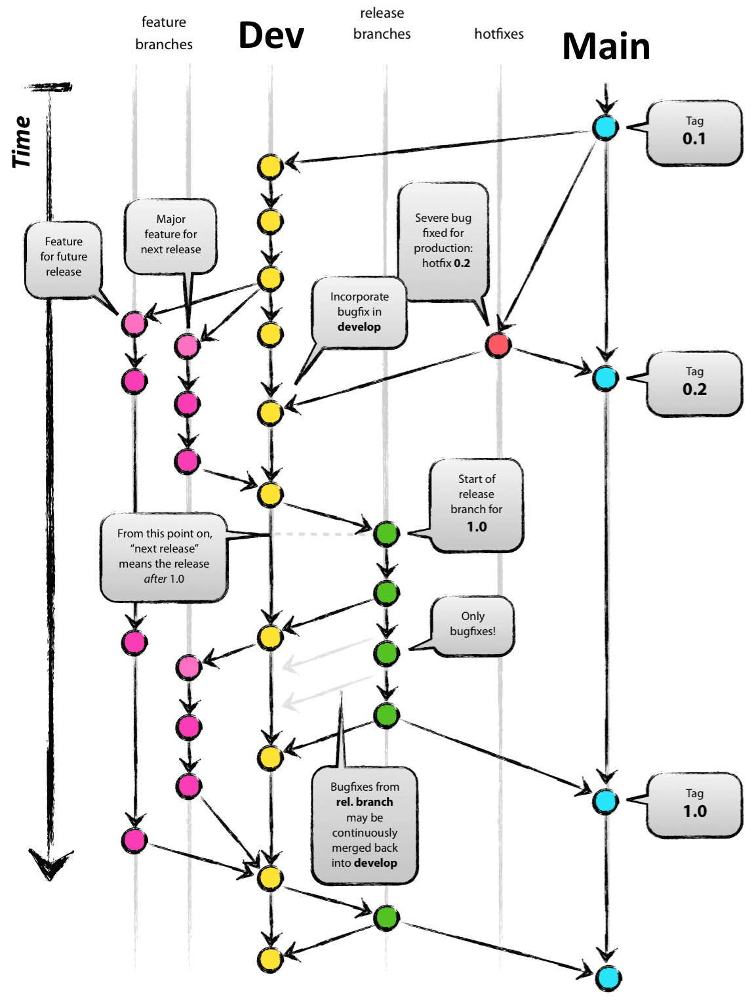

# CSCI 265 Team Standards and Processes (Phase 2)

## Team name: MacroHard

## Project name: 'Cyber' Cyber City

---
## Key contact person and email

 - Alister Lawson, AlisterLawson64@gmail.com (Main Contact)
 - Bruce Fernandes, bruce2005.ind@gmail.com secondary contact
 - Jamie Mano, jamieysabelmano1018@gmail.com
 - Marek Bettzig, bettzig@hotmail.de
 - Nick Biagioni, viud2l_1061684@d2l.viu.ca

---
## Content

In this document we will be addressing three core areas of standards and processes:
 - Documentation standards and processes
 - Coding standards and processes
 - Version control standards and processes

Each section includes discussion of how those standards/processes will be enforced, and how they will be reviewed for potential updates if/as needed.

---
## Documentation standards and processes

To ensure consistency, clarity, and effective collaboration, the team has established the following standards and processes for managing documentation throughout the project. These guidelines are designed to promote accountability, fairness in workload distribution, and adherence to quality standards in all documentation efforts. Additionally, all documentation files will be maintained in the Documentation folder within the project repository, ensuring centralized access and organization. Below is an outline of the team's approach to standards and processes:

### Standards
The team has agreed upon the following standards for creating and maintaining project documentation:

**File Types and Formatting:**
Documentation will adhere to the file types and formatting preferences specified by Professor David Wessels. This ensures uniformity and compliance with course expectations.

**Proofreading:**
Each document will be reviewed and proofread by every team member at least once before being finalized. This collaborative review process guarantees that all documents meet quality and accuracy standards.

**Conflict Resolution in Document Review:**
Discussions about documentation will involve the entire team. To avoid conflicts, team members are encouraged to promptly raise any concerns or suggestions during these discussions.

**Storage of Visual Content:**
Images used in documentation will be organized and stored in the designated “pics” folder within the project repository.

**Presentations:**
All presentations corresponding to various project phases will be saved in the “presentation” folder, ensuring ease of access and organization.

**Centralized Documentation:**
All documentation files, regardless of type or purpose, will be maintained in the Documentation folder within the project repository. This ensures a single source of truth and facilitates team collaboration.

**Version Control:**
The primary mechanism for submitting, revising, or updating documents will be via pull requests, as outlined in the version control section of this document.

### Processes
The team has adopted the following processes to ensure efficient and equitable management of documentation tasks:

**Workload Distribution:**
Documentation tasks will be divided equitably among all team members, ensuring that each person carries a fair share of the workload.

**Collaboration:**
Team members will work on documentation either individually or collectively, depending on the nature and requirements of the task.

**Group Review:**
All documents will be reviewed collectively during team meetings, providing an opportunity for feedback and final revisions before completion.

By adhering to these standards and processes, and by maintaining all documentation files in the designated Documentation folder, the team ensures a professional and organized approach to project documentation.

---
## Coding standards and processes
It is anticipated that this section may evolve as final decisions are made regarding the development environment and programming languages. However, the team has established the following initial standards and processes to ensure uniformity and collaboration in coding efforts:

### Standards
The team has adopted the following coding standards:

**Development Environment:**
All team members will use Godot 4.3 as the primary software for the project.

**Game Engine:**
The team will utilize the Godot game engine ([Godot](https://godotengine.org)) for all development work.

**Programming Language:**
All programming tasks will be completed using GDScript, the scripting language designed for use within the Godot engine.

**Style Guide:**
The team will follow the official [GDScipt style guide](https://docs.godotengine.org/en/stable/tutorials/scripting/gdscript/gdscript_styleguide.html) to ensure consistency and adherence to best practices.

**Exported Properties:**
The use of exported properties within Godot will be incorporated to simplify the programming process. Additional information is available in the [GDScript exported properties](https://docs.godotengine.org/en/stable/tutorials/scripting/gdscript/gdscript_exports.html) Guide.

### Processes

The team has established the following coding processes:

**Referencing Documentation:**
The [Godot documentation](https://docs.godotengine.org/en/stable/index.html) will be used as the primary reference for all coding-related tasks and problem-solving.

**File Structure Organization:**
Game files will be organized by function rather than file type, facilitating easier navigation and development.

**Collaborative Development:**
The team will initially work together to build the 3D Arcade hub world within Godot, ensuring a solid foundation for the project.

**Task Division:**
After completing the hub world, team members will split up to work independently on individual arcade games.

**Visual and Front-End Work:**
Once programming for each game is complete, the visual team lead will assume responsibility for creating sprites and other front-end elements.

**Playtesting:**
The final stage will involve comprehensive playtesting by all team members to identify and resolve any bugs in the arcade games and the hub world.

By adhering to these coding standards and processes, the team aims to maintain a structured and efficient approach to development, ensuring high-quality outcomes for all project components.

---
## Version control standards and processes
The team's GitHub repository (TEAM_REPO_NAME_GOES_HERE) will be established and managed by the version control lead, Marek, and his understudy, Bruce, both of whom will have admin access. This repository will follow a structured 5-branch system to facilitate efficient development, testing, and deployment, while maintaining high-quality code and collaboration. Additionally, all code merges into the repository will require peer review to ensure that the team maintains consistent standards and avoids introducing errors.

### Standards
The following version control standards have been agreed upon by the team:

**Roles and Responsibilities:**
Version control will be overseen by Marek, with Bruce serving as understudy. They will ensure proper management of the repository and adherence to the version control workflow.

**Branching Strategy:**
The repository will operate on a 5-branch system with the following designations:

**Main Branch:**
The primary branch containing only stable and working versions of the project.

**Feature Branch:**
Individual working branches for team members to develop specific features independently.

**Dev Branch:**
A collaborative branch where multiple features from Feature Branches are merged for integration and initial testing.

**Testing Branch:**
Contains developed versions of the product that are ready for rigorous testing before release.

**Hotfix Branch:**
Dedicated to urgent fixes for the Main Branch. Changes in this branch will also be incorporated into the next versions of the Main and Dev Branches.

### Processes
The team will follow these version control processes to ensure efficient and collaborative development:

**Feature Development:**
Pull the latest updates from the Dev Branch before starting work on a new feature.
Develop the feature locally in a personal Feature Branch.
Pull from the Dev Branch again to resolve any inconsistencies or conflicts before proceeding.
Submit the updated feature for a peer review by at least one other team member before it is considered for merging.

**Merging Features:**
Once the feature has passed peer review, Marek or Bruce will oversee the merge into the Dev Branch.

**Feature Integration and Testing:**
When multiple features are ready in the Dev Branch, they will be merged into the Testing Branch.
Code in the Testing Branch will undergo rigorous testing to identify and resolve bugs.
If significant bugs are found, the Testing Branch will revert to the Dev Branch for further development and fixes.

**Testing and Release:**
After successful testing, the stable version will be merged into both the Main Branch and the Dev Branch. This ensures that the Main Branch always reflects a working, production-ready state.

**Hotfixes:**
In case of critical issues in the Main Branch, a Hotfix Branch will be created.
The fix will be implemented, tested, and peer-reviewed before merging back into the Main Branch and the Dev Branch.
This ensures the fix is included in both the current and future versions of the project.

By adhering to this structured 5-branch system, requiring peer reviews for all merges, and following clearly defined processes, the team ensures a professional and collaborative approach to version control, maintaining high-quality standards and minimizing the risk of errors throughout the development lifecycle.
A visualization of the branch model can be found below:

[additional information and image source](https://nvie.com/posts/a-successful-git-branching-model/)
