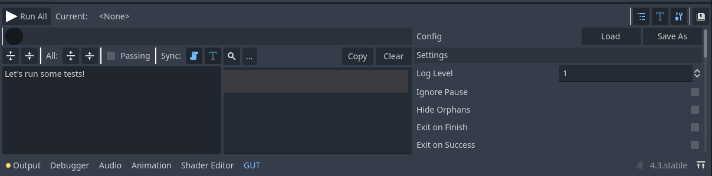
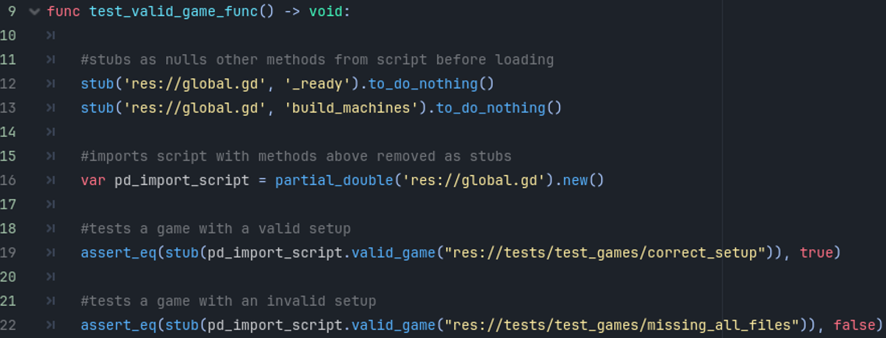
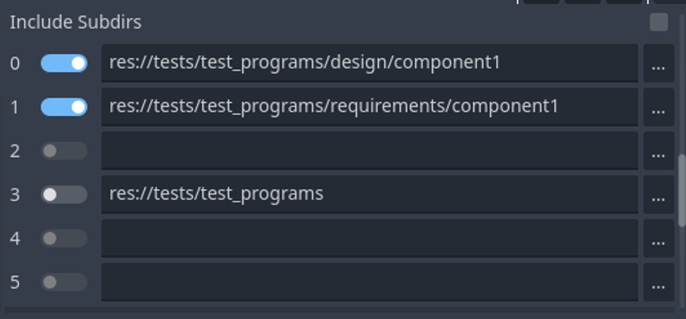


#  CSCI 265 User Acceptance Test Process (Phase 5)

## Team name: MacroHard

## Project/product name: 'Cyber' Cyber City

## Contact person and email

The following person has been designated the main contact person for questions from the reader:

 - Alister Lawson, AlisterLawson64@gmail.com *main contact*
 - Bruce Fernandes, bruce2005.ind@gmail.com *secondary contact*
 - Jamie Mano, jamieysabelmano1018@gmail.com
 - Marek Bettzig, bettzig@hotmail.de
 - Nick Biagioni, viud2l_1061684@d2l.viu.ca

# Table of Contents
1. [Known issues](#section1)
2. [Test Plan](#section2)
2.1 [Testing Overview](#section2.1)
2.2 [Key Testing Challenges](#section2.2)
2.3 [Testing Timeline](#section2.3)
2.4 [Testing Cases and Process](#section2.4)
2.5 [Test case list](#section2.5)
4. [Test infrastructure](#section3)
3.1 [Software Tools and Environment](#section3.1)
3.2 [User Action Scripts](#section3.2)
3.3 [Executables](#section3.3)
5. [Test File and Resources](#section4)
4.1 [Version control and branch structure](#section4.1)
4.2 [Test Directory Structure](#section4.2)
6. [Testing Dependencies](#section5)

# 1. Known issues 

# 2. Test Plan 

## 2.1 Testing Overview 

## 2.2 Key Testing Challenges 
"Cyber  Cyber  City's  base  functionality  is a library  of  executables, presented  as an arcade. It  is  made so creators  may  populate  it  with  arcade-style games, for a player  to browse and play."

- Player's perspective versus Creator's perspective
  - Players expect a smooth, engaging experience with easy navigation and responsive gameplay. It's essential to test not only the playability of the games but also how well the arcade interface supports browsing, searching, and launching games.
  - On the other hand, creators rely on intuitive tools to import, manage, and test their games. Ensuring that creators can easily add and modify their games within the arcade without encountering bugs or limitations is a core focus. Testing these perspectives will help identify potential friction points between the two user roles.
- Automation of tesing states based on user-generated files
  - To enhance the speed and accuracy of testing, it is critical to automate the verification of game states and interactions, especially when handling user-generated files. By automating tests for various game states, we can quickly identify and address issues related to file loading, game state transitions, and resource management, ensuring a more stable and responsive environment for players.
- Poor DirAccess Documentation

## 2.3 Testing Timeline 
- This plan assumes core features are complete, with 10 hours per week available for testing. The process includes completing test infrastructure and documentation, running component and system-level tests, and performing a final validation.

**Phase 1: Test Infrastructure Setup**

All scripts and data files required for testing are finalized, focusing on individual components like game imports, file handling, and arcade navigation.

**Phase 2: Test Documentation Completion**

Documentation for "Design" test cases is completed, covering each component. A review ensures consistency and thoroughness.

**Phase 3: Component-Level Testing**

"Design" tests are executed to validate individual components. Issues are identified and resolved to confirm core functionality.

**Phase 4: Requirements Testing**

"Requirements" tests are developed and executed to validate system-wide behavior and ensure no lower-level issues persist.

**Phase 5: Final Combined Test Pass**

All "Design" and "Requirements" tests are executed together to validate system functionality as a whole. Comprehensive reporting confirms the system meets all expectations.
Testing Priority

- **Bottom-Up Approach:** Begin with "Design" tests for components, followed by "Requirements" tests to validate higher-level system behavior.
- **Final Validation:** A combined test pass ensures complete system integrity and reliability.

## 2.4 Testing Cases and Process 
- Creator" and "Player" roles
  - Testing will focus on tools and workflows that support the import, modification, and management of games within the arcade. This includes game file handling, import workflows, and the ability to test and debug games inside the arcade environment.
  - Tests for players will ensure that they can easily navigate the arcade, find games, and experience seamless gameplay. These tests will include arcade navigation, game launching, and player interactions.
- Subjective cases: primarily focused on usability and experience, assessing how intuitive and engaging the arcade is for users.
	- Inspections of arcade elements
	- Navigation of arcade
- Objective cases: tests provide measurable outcomes, helping to ensure that the arcade's technical features perform as expected.
	- Parameters and return values
	- Components in the program where correct behaviour can be measured with scripts

## 2.5 Test case list 

# 3. Test infrastructure 

## 3.1 Software Tools and Environment 
- The testing process will be carried out within the Godot Editor. Some tests will involve the use of Windows File Explorer, and the system environment for testing will be Windows 11.

The testing framework will rely on the Godot Unit Tester (GUT) Plugin, which supports writing tests in GDScript directly within the Godot environment. The GUT plugin includes essential features such as setup/teardown methods, assertion functions, utilities, and GUT-specific tools to streamline the testing process.

Automated testing will utilize user action scripts to ensure comprehensive and consistent test coverage. Specific parts of the project, such as individual functions, will be tested using GDScript stubs provided by the GUT plugin.

All testing tools and utilities will be integrated within the Godot Editor, leveraging the GUT plugin for efficient and organized test execution.

## 3.2 User Action Scripts 
- Used for multi-tool actions performed by creators (game file manipulation)
- Used for player character behaviour tests

- Description:
	- Step-by-step guides for consistent and reproducible manual testing.
	- Detail specific tester actions, expected behavior, and pass/fail criteria.
	- Include prerequisites, precise instructions, and result assessments.
	- Ensure reliability and clarity in validating product features.
	
### Sample Script
**Step 1: Verify the First-Person Point of View**
- Observe the screen. Ensure the Field of View (FOV) is set to 90 degrees.
- Move the camera left, right, up, and down by dragging the mouse.
- **Expected Result:**
	-Horizontal camera rotation is infinite.
	-Vertical camera rotation locks 90 degrees up and down from the horizon.
	
**Step 2: Test Basic Movement Controls**
- Press W: The player character moves forward at approximately 1.4 meters per second.
- Press S: The player character moves backward at the same speed.
- Press A: The player character strafes left at the same speed.
- Press D: The player character strafes right at the same speed.
- **Expected Result**: 
	- Movement corresponds to the input key, matches the described speed, and appears smooth.

**Step 3: Test Interaction Range**
- Approach an interactable object (e.g., a glowing button) within 2 meters of the player character.
- Ensure the object is aligned with the center of the screen.
- Press Left Click to interact.
- **Expected Result**:
	- The defined behavior of the object (e.g., the button lights up or a door opens) occurs.
	- No interaction occurs if the object is outside the 2-meter range or not aligned with the screen center.

**Step 4: Boundary Testing for Interaction**
- Move the player character just outside the 2-meter range of the object.
- Press Left Click to attempt interaction.
- Expected Result: No interaction occurs.
- Move the object off the center of the screen but within 2 meters.
- Press Left Click to attempt interaction.
- **Expected Result**: 
	- No interaction occurs.

## 3.3 Executables 
- Test scripts  written in gdscript

# 4. Test File and Resources

## 4.1 Version control and branch structure 
- Testing files directory treated like a "feature" in version control
- All files included in project directory, but will be excluded from final program compilation
- Done on same branch as Dev but each test is branched as a feature

## 4.2 Test Directory Structure 
- All within development branch game directory
- Separated by user scripts and test programs
- Test games setup for test cases from both
- Each subsection split into design and requirements folders
- Arranged for easy picking of layers for test programs with GUT

# 5. Testing Dependencies 

- Windows 10-11 operating system
- A file explorer or command shell
- Project imported into Godot editor (GUT addon bundled in dev branch project folder)
